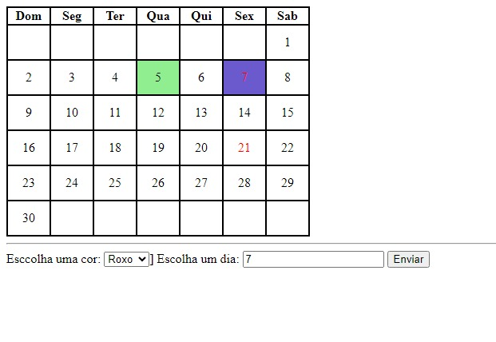

# Indice

 

[Formulário_Cadastro](#formulario_cadastro)  

[Descrição](#descrição)  

[Introduçao](#introduçao)  

[Funcionalidade](#funcionalidade)  

[Tecnologias Utilizadas](#tecnologias-utilizadas)  

[Fontes Consulta](#fontes-consulta)  

[Autores](#autores)  

  # calendario
atividade de programação web
 
 
 
## Descrição
* Foi uma atividade que executamos em sala de aula com alunos junto com o professor.

## Introdução
* Proposto atividade para mais conhecimento com instruções do professor Leonardo usando Vscode.

## Funcionalidade
* Executar um calendário com uma funçaõ que voçê pode selecionar um dia do mês e escolher uma cor para o marcá-lo.

## Tecnologias Utilizadas
* ``HTML``

* ``CSS``

* ``VSCODE``

* ``JAVASCRIPT``

* ``GITHUB,GIT``

## Fontes Consulta
* [Github](https://github.com/helosilvax/calendario)

